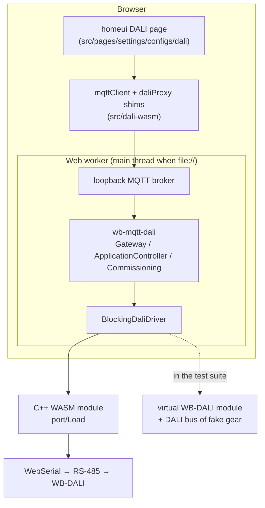
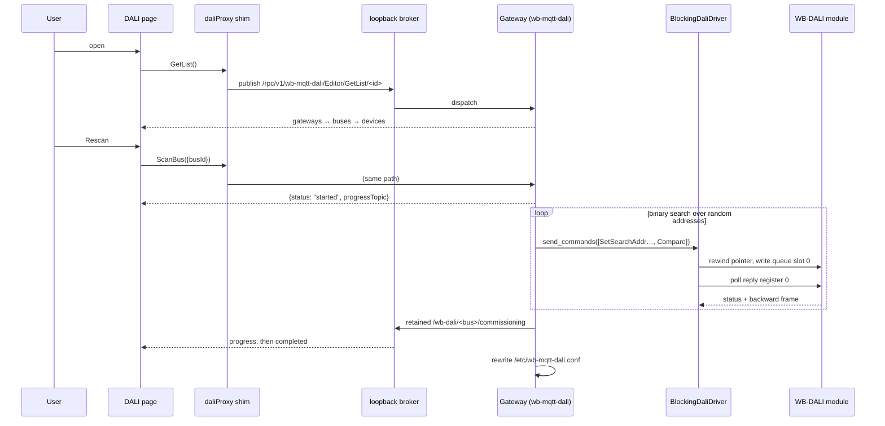

# DALI in the browser — Architecture Decision Record

## 1. Introduction and Goals

The DALI configuration interface that Wiren Board controllers offer is two
pieces of software: a React page in **homeui**, and the **wb-mqtt-dali** Python
daemon it drives over MQTT-RPC. This adds that interface to the standalone WASM
device editor, which runs entirely in a browser with no controller behind it.

### Key requirements

- The **homeui DALI page runs unmodified**. It is a live product surface; a fork
  would diverge from it within weeks.
- The **wb-mqtt-dali daemon runs unmodified**. It carries the DALI protocol
  knowledge — commissioning, device types, memory banks, parameter schemas —
  that is the whole reason to reuse it rather than reimplement it.
- Works with **no hardware attached**, because that is the common case for
  someone evaluating or learning the tool, and because it is what makes the
  thing testable.
- Works with **real hardware** over the same WebSerial port the Modbus editor
  already uses.
- Works in the **offline single-file build**: one HTML file, opened from disk.

## 2. Constraints

- A browser has no MQTT broker, no filesystem, no sockets and no Python.
- The offline build is opened over `file://`, where Chrome refuses to start a
  module worker at all.
- There is one WebSerial link, shared with the Modbus editor.
- Neither upstream project may be forked. Every adaptation has to be a shim, a
  substituted name, or new code alongside.

## 3. Context and Scope



## 4. Solution Strategy

Three seams, each chosen because it is the narrowest interface the code above it
already depends on.

### 4.1 The UI's seam: homeui's `mqttClient` module

The DALI page takes no props. It reaches its transport through homeui's own
module singletons — `daliProxy`, built on `createRpcProxy`, and `mqttClient` —
so substituting that one module at build time (`redirectHomeuiMqttClient` in
vite.config.ts, by resolved path, because homeui imports it relatively) puts
homeui's own RPC proxy and every DALI store on the in-browser broker unchanged.
Even the wire format is the real one: `{id, params}` published to
`/rpc/v1/wb-mqtt-dali/Editor/<Method>/<clientId>`, reply on `.../reply`.

What the page does expect around it is app chrome the standalone editor does not
have: a router, and the console panel its bus monitor docks into. The DALI view
supplies both.

The one thing the page needs that a standalone tool cannot answer is
`authStore.hasRights(UserRole.Admin)`, which gates `PageLayout` behind an
`/auth` endpoint that does not exist here. A standalone tool has one local user,
who is the administrator.

### 4.2 The daemon's seam: the `aiomqtt.Client` it publishes on

`Gateway`, `MQTTRPCServer` and `ApplicationController` publish and subscribe for
a living — the `Editor/*` RPC, the commissioning progress topic, the virtual
devices. They take an `aiomqtt.Client` to do it with, so they get a loopback one
attached to an in-process broker.

That broker is the daemon's own bus. **No DALI traffic goes through it.**

### 4.3 The DALI seam: `BlockingDaliDriver`

This is the decision that shapes everything below the daemon.

`WBDALIDriver` is built to be fast on a controller. It batches up to sixteen
frames into the gateway's send queue, lets wb-mqtt-serial stream the results
back as sporadic Modbus events, and reassembles them by matching MQTT reply
topics to queued futures. Reproducing that in a browser means emulating
wb-mqtt-serial's entire MQTT surface — a `port/Load` RPC, sixteen reply-register
topics per bus, a four-slot bus monitor ring, an availability topic — to serve a
transport that has one link and one request in flight at a time.

`BlockingDaliDriver` is what is left when that is taken away:

```
rewind the gateway's consume pointer to slot 0   (function 6, holding 1432)
write the encoded frame into queue slot 0        (function 16, holding 1400)
poll reply register 0 until it reports a transmission   (function 4, input 1500)
turn status + backward frame into a python-dali Response
```

`ApplicationController` constructs its own driver, so the adaptation is to
substitute the name it constructs:

```python
application_controller.WBDALIDriver = make_driver_class(transport)
```

Everything above — commissioning's binary search, DT parameter reads, the whole
Editor RPC — is unchanged production code.

**Confirmed against a real module** (WB-DALI, firmware 1.0.0, five Skydance
devices on bus 1). Four behaviours were measured, and the protocol above is
shaped by them:

| Behaviour | Measured |
| --------- | -------- |
| Writing a queue slot clears its reply register | Yes — the slot reads back status 0 immediately after the write and takes its real status a few ms later. This is what makes a non-zero status mean *this* frame's answer. |
| Anything else clears a reply register | No. Not a pointer rewind, not elapsed time. A slot never written keeps a stale status indefinitely. |
| The gateway consumes slots strictly in order | Yes. With the pointer at 0, a frame armed in slot 5 sat unsent indefinitely and the pointer never moved; arming slot 0 sent it at once. The gateway waits at its pointer and never skips ahead. |
| A consumed slot is cleared by the firmware | Yes — which is why rewinding the pointer is safe: it cannot re-send anything. |

The third row is why every frame goes into slot 0 behind a pointer rewind rather
than into a slot chosen by a counter. A driver that picks slots itself has to
keep its counter in lockstep with the firmware's pointer forever, and nothing
restores that invariant once it breaks: one dropped frame leaves every later
write parked ahead of the pointer, stalling until the counter wraps all the way
round. That is not hypothetical — the first hardware run did exactly this, in
bursts of consecutive one-second timeouts that healed after roughly sixteen
frames, at a 4% frame loss rate overall. Rewinding first re-establishes the
invariant on every frame instead of assuming it; the cost is a third Modbus
transaction, about a millisecond against a DALI frame'"'"'s thirty-five. After the
change, 665 frames across an idle period and a full bus rescan lost none.

The simulator models all four behaviours, including the in-order pointer, so
this class of stall is reproducible in the test suite. It did not model the
pointer at first, which is precisely why the bug reached hardware.

The same assumption has a cost on the other side. Status 0 means "not
transmitted", and the driver reads it as "not transmitted *yet*" — so a frame
the gateway genuinely failed to send blocks for the full response timeout and
comes back as `NoResponseFromGateway` rather than `NoTransmission`, which the
daemon then retries three times. On a real module that would be worth
distinguishing; there is no way to do it from a register that reports both
states with the same value.

### 4.3.1 The bus monitor, also polled

A reply register answers a frame *we sent*. Traffic we did not send — a DALI-2
pushbutton press, another master's command — reaches the gateway's four-slot
bus-monitor ring instead, and that ring is polled too, on the same principle:
read registers `1900 + bus_off + 4r` and hand each new slot to the daemon's own
`BusMonitorFrameHandler`, which does the decoding, the reordering by frame
counter and the gap reporting exactly as it does on a controller.

Two things follow from polling rather than being pushed.

The ring is four frames deep, so a burst arriving faster than the poll interval
overwrites the oldest. That is not silent: the handler tracks the frame counter
and reports the gap. The interval is 100 ms, which is about four frames' worth
of DALI at 1200 baud.

Reading it competes with DALI traffic for the one serial link, so it is off
unless asked for — wired to the `bus_monitor_enabled` flag the bus tab already
exposes, which on a controller only decides whether the daemon republishes what
wb-mqtt-serial pushes at it.

The simulated installation the test suite runs against includes a wall switch
that presses itself every few seconds, because otherwise there is no traffic
the daemon did not originate and nothing for the monitor to show. In homeui's
console panel those arrive tagged `foreign`, which is exactly what they are.

### 4.4 Below the driver: one interface, two implementations

```python
class RegisterTransport(Protocol):
    async def read_input(self, device_id, address, count) -> list[int]: ...
    async def write_holding(self, device_id, address, values) -> None: ...
```

| Implementation | What it is |
|---|---|
| `hardware.WasmSerialTransport` | The C++ WASM module's `port/Load` RPC over WebSerial — what the page runs on |
| `sim.network.SimulatedModbusNetwork` | Virtual WB-DALI modules over simulated DALI buses — what the test suite runs on |

The simulated network started life as a user-facing mode, from before there was
hardware to develop against; the page now boots exclusively against real
gateways, and the simulator remains as the rig the whole stack is tested on.
The daemon cannot tell the two apart.

`port/Load` answers in a JSON-RPC envelope — `{error, result}` — with the register
payload one level down under `result.response`. Reading it at the top level is
not an error but an empty string, so every register read yields no registers and
the driver reports "no response from gateway" a long way from the cause. The
transport'"'"'s test double returns the full envelope for that reason; an earlier
one returned the inner object, which is why the suite passed against a mistake
that made real hardware unusable.

## 5. Building Block View

### 5.1 The simulator

Emulation happens at the **Modbus register level**, not at the DALI command
level. Everything above the registers — frame encoding, the queue, commissioning
— is therefore production code exercising the real protocol.

| Module | Role |
|---|---|
| `registers.py` | The WB-DALI register map, shared by the driver and the simulator |
| `sim/gateway.py` | The module: send queue, reply registers, three buses |
| `sim/dali_bus.py` | One bus: decodes frames, delivers them, models collisions |
| `sim/control_gear.py` | The units on the bus |

The control gear and control devices are built on **python-dali's own test
fakes**, which already model memory banks, DTR handling, the DT8 colour
extensions and the control-gear commissioning state machine. What they do not
model is filled in by a subclass rather than by patching the vendored copy:

- `QUERY SHORT ADDRESS`, which the binary search reads to identify the device it
  has isolated. Without it a scan readdresses the whole bus.
- A factory random address. The fakes start at 0 and only pick one on RANDOMISE,
  so an untouched bus looks like a bus of address conflicts.
- The standard gear variables of IEC 62386-102 §9.10 and the DT8 colour-type
  queries. `Editor/GetDevice` reads every parameter a unit's device types imply,
  in batches, and one unanswered query fails a whole batch — a gap does not
  degrade the device form, it empties it.
- The **whole DALI-2 commissioning state machine** of IEC 62386-103 §11 and the
  per-instance settings. The fake control device models instances, DTRs and
  memory banks but no addressing at all, so the input-device half of every scan
  came back empty. Note that its INITIALISE parameter is the reverse of the
  control-gear one: `0xFF` selects every device, `0x7F` the unaddressed ones.

### 5.2 Hosting Python

Pyodide 314 (CPython 3.14), loaded from two byte assets and two tarballs:

| Asset | Size | Contents |
|---|---|---|
| `pyodide.asm.wasm` | 9.2 MB | the interpreter |
| `python_stdlib.zip` | 2.4 MB | the standard library |
| `wbdali-py.tar.gz` | 0.5 MB | wb-mqtt-dali, python-dali, jsonschema, our runtime |
| `wbdali-data.tar.gz` | 0.2 MB | the daemon's package data |

`scripts/fetch-python-sources.sh` vendors the upstream sources verbatim;
`wasm/scripts/build-python-bundle.mjs` stages and packs them. The jsonschema
stack is not pure Python — `rpds-py` is a Rust extension — so its wheels come
from the installed Pyodide's own lock file, which is what keeps the ABI matched.

Adaptation is four stub modules under `wasm/python/shims`: `aiomqtt` (re-exports
the loopback broker's types), `websockets` and `wb_common` (import-time only),
and a vendored copy of `paho.mqtt.matcher`, the one dependency-free file
`MQTTDispatcher` actually uses.

### 5.3 Where the runtime runs

In a **web worker** normally: a bus scan is thousands of DALI transactions
driven by a Python event loop, and on the main thread that fights React for the
same microtask queue.

On the **main thread** in the offline build, because a `file://` page cannot
start a module worker. The runtime is host-agnostic for exactly this reason;
only where the bytes come from and where replies go differ.

Vite rewrites `new Worker(new URL(...))` during transform, before dead-code
elimination, so the call lives in its own module that the offline build aliases
away. Guarding it at runtime is not enough — it would still emit a 13 MB worker
chunk that `vite-plugin-singlefile` does not inline.

Running on the main thread also changes what "yield to the event loop" costs.
The simulator used to yield on every register operation; under Pyodide each
yield is a `setTimeout`, which browsers clamp to about 4 ms once nested, and a
scan that took seconds in a worker took minutes inline. Yielding by *elapsed
time* — at most one animation frame of uninterrupted work — fixed it. Measured
on the default installation, four luminaires and a wall switch: **1.5 s in the
worker, 1.7 s inline**, the page at ~55 fps throughout.

## 6. Runtime View — opening the page and scanning a bus



## 7. Design Decisions

| Decision | Rationale |
|---|---|
| Blocking request-response driver | One link, one request in flight. The batching, sporadic events and reply-topic bookkeeping bought nothing and cost an emulated wb-mqtt-serial. |
| Simulate at the Modbus register level | Keeps frame encoding, the queue and commissioning as production code. Simulating at the command level would have tested the simulator instead. |
| Reuse python-dali's fakes, extend by subclass | Memory banks, DT8 and the gear commissioning machine already existed. Patching the vendored copy would have made it un-refetchable. |
| Keep the loopback broker for the daemon's own bus | `Gateway` and `MQTTRPCServer` publish for a living. Removing MQTT there means forking the daemon. |
| Substitute `WBDALIDriver` by name | `ApplicationController` constructs it directly. One assignment beats a fork. |
| Gate the page on a serial port | Every DALI command reopens the port, the browser's chooser needs a user gesture it will not get, and the daemon's retries keep coming — the page dies under `ERR_INSUFFICIENT_RESOURCES`. Probing for an already-granted port shows a loader, not the ask. |
| Gate the page on a found gateway | The configurator means nothing without a WB-DALI to configure; without one remembered from a Modbus scan the page says so and points back. |
| Seed groups from the previous session at boot | The page reads its device tree once, at mount, and only a commissioning run rebuilds it — but group membership lives on the gear, read during device init, tens of seconds after boot. The persisted snapshot makes the first tree correct immediately; init still reads the truth off the bus behind it. Only a device with no seed is worth holding boot for. |
| DALI runtime out of the service worker's eager precache | 13 MB in the bucket whose install must succeed would make every visit to the Modbus editor pay for it, and one failed request would lose offline support for the editor too. |
| Bus monitor polled, and only on request | Four slots deep, so a burst outruns it — but the gap is reported, not silent. Reading it competes with DALI traffic for the one link. |
| The runtime outlives the DALI view | The daemon's knowledge of the bus — memory banks, probed features, a first device-page open worth 400+ frames — lives in its memory. Killing the worker on navigation re-paid all of it every visit (measured: 163 frames to re-init a lamp, 426 for its first page). Kept alive, reopening the view and revisiting pages is instant; the worker is replaced only when a rescan changes the gateways, and dies with the tab. Its polling shares the port with the editor transaction by transaction. |
| Drop a saved installation only after two failed boots | Most boot failures are transient (a busy port, an interrupted fetch), and the config carries operator-given names; but one that fails every boot would lock the page shut with no way out from inside it. |
| Replace homeui's gateway tab | Its only content is the Lunatone DALI-2 IoT Gateway emulator — a WebSocket *server*, which a browser page cannot be — and homeui lands on it. The substitute shows the module's address and line settings instead. |

## 8. Files

| File | Role |
|---|---|
| `scripts/fetch-python-sources.sh` | Vendors wb-mqtt-dali, python-dali, mqttrpc, jsonrpc, paho's matcher |
| `wasm/scripts/build-python-bundle.mjs` | Stages and packs the two tarballs; fetches the ABI-matched wheels |
| `wasm/python/runtime/wbdali_browser/registers.py` | The WB-DALI register map |
| `wasm/python/runtime/wbdali_browser/dali_driver.py` | `BlockingDaliDriver` |
| `wasm/python/runtime/wbdali_browser/broker.py` | The loopback MQTT broker |
| `wasm/python/runtime/wbdali_browser/serial_service.py` | The one wb-mqtt-serial RPC the daemon's boot needs |
| `wasm/python/runtime/wbdali_browser/runtime.py` | Boots the daemon; config persistence |
| `wasm/python/runtime/wbdali_browser/scenario.py` | Reads the installation description; builds the test suite's simulated network |
| `wasm/python/runtime/wbdali_browser/hardware.py` | Registers over the C++ module's `port/Load` |
| `wasm/python/runtime/wbdali_browser/browser.py` | The API the JavaScript side calls |
| `wasm/python/runtime/wbdali_browser/sim/` | The virtual module, bus and units |
| `wasm/python/shims/` | `aiomqtt`, `websockets`, `wb_common` |
| `wasm/src/dali-wasm/dali-runtime.ts` | Boots Pyodide; host-agnostic |
| `wasm/src/dali-wasm/dali-worker.ts` | Hosts it in a worker |
| `wasm/src/dali-wasm/pyodide-backend.ts` | The page's side; picks worker or main thread |
| `wasm/src/dali-wasm/mqtt-client.ts` | homeui's `mqttClient`, over the broker |
| `wasm/src/dali-wasm/dali-proxy.ts` | homeui's `daliProxy`, over the broker |
| `wasm/src/dali-wasm/dali-wasm.tsx` | Mounts the homeui page |

## 9. Testing

The Python runs under CPython in `wasm/python/tests`, which is where the
debugging happens — a failure there is a stack trace, not a stack trace inside
a WASM interpreter inside a worker. The suite drives the production daemon over
the simulated bus: commissioning finds unaddressed gear and assigns short
addresses, `Editor/GetDevice` reads a DT6 and a DT8 unit in full, DALI-2 input
devices are discovered and configured, and the RPC surface the UI calls answers.

The technique worth repeating: when a device form came back empty, tracing which
queries the simulated bus left *unanswered* during a real `GetDevice` turned six
rounds of one-at-a-time debugging into one.
