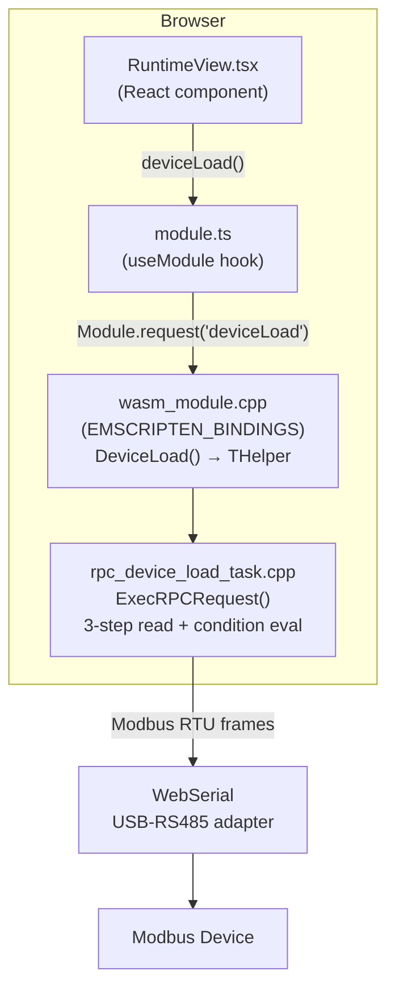
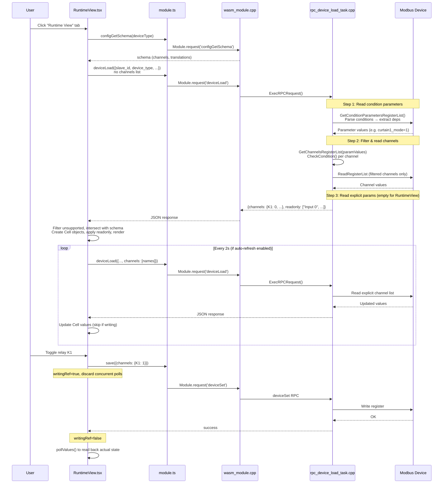

# Runtime View — Architecture Decision Record

## 1. Introduction and Goals

Runtime View is a tab within the WASM Device Editor that shows **live channel values** read directly from a Modbus device over WebSerial. It allows the operator to monitor sensor readings, relay states, and diagnostic values in real time, and to toggle writable channels (e.g. relay commands).

### Key Requirements

- Display only the channels that are **relevant to the current device configuration** (e.g. hide curtain channels when curtain mode is off).
- **Minimize serial I/O** — do not read registers for channels that will be filtered out.
- Channel filtering must use **actual parameter values stored on the device**, not unsaved editor state.
- Support auto-refresh polling with a configurable toggle (persisted in localStorage).
- Hide channels reported as `"unsupported"` by the device.
- Correctly apply read-only status from the device response to prevent writes to read-only channels.

## 2. Constraints

- The WASM module embeds `wb-mqtt-serial` C++ code compiled via Emscripten. All Modbus I/O happens inside the WASM binary; JavaScript cannot access serial registers directly.
- WebSerial is the transport layer between the browser and the physical RS-485 adapter.
- Device templates define channels with optional `condition` expressions (e.g. `curtain1_mode==1`) that reference device parameters.
- Templates may have **duplicate channel names** with different `condition`/`sporadic` settings (e.g. `Input 0` appears twice — one for sporadic mode, one for non-sporadic). All template entries must be included so condition filtering can select the correct one.

## 3. Context and Scope



## 4. Solution Strategy

### Why evaluate conditions in C++?

Before this feature, `deviceLoad` had no condition filtering at all — it read every channel defined in the template. An earlier development branch attempted JS-side filtering using `configParams` from the Settings tab, but it was never released because it used unsaved editor state rather than actual device values, and still read all registers before filtering.

The correct approach evaluates conditions in C++ inside `ExecRPCRequest`, mirroring how the production daemon (`MergeDeviceConfigWithTemplate`) handles conditions. This achieves two goals:

1. **Semantic correctness** — conditions reflect the device's actual stored parameters, not unsaved editor state.
2. **Minimal I/O** — channels that fail their condition are excluded before any Modbus reads, avoiding unnecessary serial traffic.

## 5. Building Block View

### 5.1 C++ Layer

#### `ExecRPCRequest(port, rpcRequest)` — `rpc_device_load_task.cpp`

The core orchestration function. Executes a three-step serial I/O sequence:

```
Step 1: GetConditionParametersRegisterList()
        → ReadRegisterList()
        → Assemble conditionParamValues (Json::Value)

Step 2: GetChannelsRegisterList(conditionParamValues)
        → Filter channels by CheckCondition()
        → ReadRegisters() for surviving channels
        → Mark read-only channels by AccessType

Step 3: GetParametersRegisterList()
        → ReadRegisters() for explicitly requested params
        → Reuse values already read in Step 1

Return: { channels: {...}, parameters: {...}, readonly: [...] }
```

**Note**: The `readonly` field is a **JSON array** of channel name strings (e.g. `["Input 0", "Supply Voltage", ...]`), not an object. Channels are marked read-only based on their register's `AccessType == READ_ONLY` (determined by Modbus register type: `discrete` and `input` registers are read-only, `coil` and `holding` are read-write).

#### `GetConditionParametersRegisterList()`

Scans the device template to find which parameters are needed for condition evaluation:

1. Iterates all template channels looking for `"condition"` fields.
2. Parses each condition expression using `Expressions::TParser`.
3. Extracts variable names via `Expressions::GetDependencies(ast)` — e.g. condition `curtain1_mode==1` yields dependency `"curtain1_mode"`.
4. Deduplicates dependencies across all channels into a `std::set<std::string>`.
5. Looks up matching parameter definitions in the template's `"parameters"` section.
6. Returns a `TRPCRegisterList` for only those parameters.

If no channel has a condition, returns an empty list (step 1 becomes a no-op).

#### `GetChannelsRegisterList(conditionParams)`

Builds the channel register list, with optional condition filtering:

1. Collects channels from the template (skipping write-only channels with no `address`).
2. If `Channels` list is empty (initial RuntimeView call), includes **all** readable channels. If explicit channels are requested, includes **all template entries** matching the requested names (not just the first match — important for templates with duplicate channel names under different conditions).
3. If `conditionParams` is non-empty, wraps it in `TJsonParams` and evaluates each channel's `"condition"` via `CheckCondition(item, jsonParams, &cache)`.
4. Channels that fail their condition are removed **before** `CreateRegisterList()`, so no Modbus registers are allocated or read for them.

**Duplicate channel names**: A separate `notFound` copy of the requested `Channels` list is used for validation. The original `Channels` list is not modified during iteration, ensuring all template entries with the same name are included and can be evaluated by condition filtering.

#### `ReadRegisters()`

Helper that reads a register list, converts values to JSON, marks read-only channels (by checking `AccessType == READ_ONLY`), and runs the `MarkUnsupported` heuristic (re-reads 0xFFFE registers with continuous-read disabled to distinguish unsupported from genuine values).

#### Shared Modbus I/O — `rpc_helpers.h` / `rpc_helpers.cpp`

Low-level register read/write functions shared between `rpc_device_load_task.cpp` and `rpc_device_load_config_task.cpp`:

- **`ReadModbusRegister(port, request, registerConfig, value)`** — reads a single register with retry logic (`MAX_RPC_RETRIES=2`). Handles `TResponseTimeoutException`, fatal/non-fatal `TModbusExceptionError`, and generic `TErrorBase`.
- **`WriteModbusRegister(port, request, registerConfig, value)`** — same retry structure for writes.
- **`IsAllFFFE(value)`** — checks if all words in a register value are `0xFFFE` (the Wiren Board "unsupported register" marker). Handles both integer registers (16-bit word check) and string registers (`\xFE` byte check).

These were extracted from duplicate anonymous-namespace copies in both task files, fixing a missing-`return`-after-success bug and a silent-failure-on-last-retry bug in the process.

### 5.2 WASM Bridge (`wasm_module.cpp`)

`DeviceLoad(requestString)` is the Emscripten-bound entry point:

1. Creates a `THelper` that parses the JSON request, loads the device template, and creates a `PSerialDevice`. Schema validation is intentionally skipped — the standard `device-load-request` schema requires `path`/`ip`/`device_id` fields that are not applicable in the WASM/WebSerial context.
2. Calls `SetWbDevice(true)` when the template has a `"hw"` section or `"enable_wb_continuous_read"` flag — this mirrors the daemon's `TRPCDeviceHelper` logic. When `IsWbDevice()` is true, `PrepareSession` will read `fw_version` from the device over Modbus (register 250) before any register list operations.
3. Calls `ParseRPCDeviceLoadRequest()` to build a `PRPCDeviceLoadRequest`.
4. Executes `TRPCDeviceLoadSerialClientTask(rpcRequest).Run(Port, ...)`.
5. Result/error callbacks serialize the response back to JavaScript via `SendReply()`. All RPC entry points (`DeviceLoad`, `DeviceSet`, `DeviceLoadConfig`, etc.) catch exceptions and call `OnError()` so that failures always produce a JSON error response rather than leaving the JS caller hanging.

### 5.3 JavaScript Bridge (`module.ts`)

```ts
const deviceLoad = useCallback(async (data: any) => {
  await initializeModule();
  return Module.request('deviceLoad', data);
}, [initializeModule]);
```

`Module.request()` serializes the request to JSON, calls the WASM function, and returns a promise that resolves with the parsed JSON response.

### 5.4 React Component (`runtime-view.tsx`)

#### Initialization (`useEffect` on `deviceCfg.device_type` / `deviceCfg.slave_id`)

1. Fetches the device template schema via `configGetSchema(deviceType)` — this provides channel metadata (names, types, units, translations) but no register values.
2. Calls `deviceLoad()` **without** a `channels` list. This tells C++ to read all channels (after condition filtering). The initial call serves double duty: it discovers which channels exist and provides their first values.
3. Builds a `channelsByName` map from the schema, then intersects it with the keys returned by C++ (`result.channels`), **excluding channels with `"unsupported"` values**. This produces the final ordered channel list — only channels that both exist in the template AND passed their condition AND are supported by the device firmware.
4. Creates `Cell` objects (MobX-observable view models from homeui) for each surviving channel, with translated names, types, units, and initial values.
5. Applies read-only status from the `readonly` array in the response. The `applyReadonly()` function converts the array to a `Set` and sets each cell's read-only flag: `true` for cells in the set, `false` for the rest.

#### Polling (`setInterval` at 2000ms)

Subsequent polls call `deviceLoad()` **with** the explicit `channels` list from initialization. This reads exactly the same channels each poll cycle. Auto-refresh is off by default; its state is persisted in `localStorage`. Manual "Refresh" button triggers a single poll. Polling is paused when the browser tab is hidden (uses `document.visibilityState`).

#### Writing

When the user toggles a switch (e.g. a relay command), `handleWrite` sets a `writingRef` flag, calls `save()` (which maps to `deviceSet` RPC) to write the new value, then clears the flag and triggers a `pollValues()` to reflect the change. The `writingRef` flag causes any concurrent poll response (from auto-refresh) to be discarded, preventing UI flicker where the old value briefly appears before the write takes effect. Writing always triggers a poll afterwards regardless of the auto-refresh setting.

#### Rendering

Channels are rendered in a two-column flex layout using `deviceSettingsEditor-topGroupContent` (reused from homeui). Each channel is a `<CellContent>` component that renders the appropriate widget based on `cell.type` (switch, value, text, etc.).

### 5.5 Integration in `device-settings-wasm.tsx`

RuntimeView is rendered as the last tab alongside the settings parameter groups (Outputs, Safety Mode, Delays, etc.):

```tsx
<TabContent activeTab={activeSettingsTab} tabId={RUNTIME_VIEW_TAB_ID}>
  <RuntimeView
    deviceCfg={{ ...getDevice().cfg, device_type: tabstore.deviceType }}
    deviceLoad={deviceLoad}
    save={save}
    configGetSchema={configGetSchema}
  />
</TabContent>
```

Props no longer include `configParams`, `evaluateCondition`, or `fwVersion` — condition filtering is entirely server-side (C++), and firmware version is read directly from the device by `PrepareSession`.

The "Select port" button is always visible and shows the current port name in parentheses when a port is selected (e.g. "Select port (ttyACM0)"). Port auto-selection happens automatically when only one matching port is available.

## 6. Runtime View — Sequence Diagram



## 7. Design Decisions

| Decision | Rationale |
|----------|-----------|
| Condition evaluation in C++ | Uses the same `CheckCondition` / `TJsonParams` / `Expressions::TParser` infrastructure as the production daemon. Single source of truth. |
| Read condition params first, then channels | Avoids reading registers for channels that will be discarded. On a WB-MR6CU with curtain mode off for 4 outputs, this saves ~20 register reads per poll cycle. |
| Initial poll without channel list | Lets C++ determine which channels pass conditions. JS doesn't need to know condition logic. |
| Subsequent polls with explicit channel list | Avoids re-evaluating conditions every 2 seconds. Channel set is stable until the user rescans. |
| Include all duplicate template entries for a channel name | Templates may define the same channel name with different `condition`/`sporadic` settings. All entries must be passed to condition filtering so the correct one is selected. |
| `readonly` as JSON array | C++ returns an array of channel name strings. The frontend converts it to a `Set` for O(1) lookup and applies read-only/read-write status to all cells. |
| Hide unsupported channels | Channels returning `"unsupported"` are excluded during initialization and not polled subsequently. |
| Auto-refresh off by default, persisted in localStorage | Avoids continuous serial traffic when first opening the tab. User preference is remembered across sessions. |
| Suppress poll responses during writes | `writingRef` flag prevents auto-refresh poll results from overwriting the UI with stale values while a write is in flight. |
| Always poll after write | Ensures the UI reflects the actual device state after a write, regardless of auto-refresh setting. |
| `fw_version` read from device via `PrepareSession` | Some registers are gated by firmware version in templates. `PrepareSession` calls `PrepareImpl` which reads `fw_version` from Modbus register 250 for WB devices, so firmware-gated registers are handled automatically without frontend involvement. |
| `max-width: 50%` on parameters | Prevents the last channel from stretching full-width when there's an odd number of channels in the two-column flex layout. |
| `column-gap: 40px` in RuntimeView | Increases horizontal separation between the value in column 1 and the label in column 2 for readability. |

## 8. Files

| File | Role |
|------|------|
| `submodule/wb-mqtt-serial/src/rpc/rpc_helpers.h` | Shared declarations: `ReadModbusRegister`, `WriteModbusRegister`, `IsAllFFFE`, `MAX_RPC_RETRIES` |
| `submodule/wb-mqtt-serial/src/rpc/rpc_helpers.cpp` | Shared Modbus register I/O with retry logic, used by both `deviceLoad` and `deviceLoadConfig` tasks |
| `submodule/wb-mqtt-serial/src/rpc/rpc_device_load_task.h` | Declares `GetConditionParametersRegisterList()`, updated `GetChannelsRegisterList(conditionParams)` |
| `submodule/wb-mqtt-serial/src/rpc/rpc_device_load_task.cpp` | Implements the 3-step `ExecRPCRequest`, condition dependency extraction, and channel filtering |
| `wasm/src/wasm_module.cpp` | `DeviceLoad()` entry point, Emscripten binding, `SetWbDevice()` for fw_version auto-detection |
| `wasm/src/device-settings-wasm/module.ts` | `deviceLoad` callback wrapping `Module.request('deviceLoad', ...)` |
| `wasm/src/device-settings-wasm/device-settings-wasm.tsx` | Mounts `<RuntimeView>` as a tab, passes props, port selection button |
| `wasm/src/device-settings-wasm/components/runtime-view/runtime-view.tsx` | React component: init, polling, cell rendering, write handling, readonly application |
| `wasm/src/device-settings-wasm/components/runtime-view/runtime-view.css` | Layout tweaks for two-column display |

## 9. Removed Code

The following unreleased development artifacts were removed in favor of C++-side condition evaluation:

| What | Why removed |
|------|-------------|
| `eval-condition.ts` | JS-side expression evaluator, superseded by C++ `CheckCondition()` |
| `evaluateCondition` callback in `module.ts` | Wrapper around `eval-condition.ts`, no longer needed |
| `evaluateCondition` / `configParams` / `fwVersion` props on `RuntimeView` | `evaluateCondition`/`configParams` carried unsaved editor state for JS filtering, replaced by actual device values read in C++. `fwVersion` is now read from the device by `PrepareSession` instead of being passed from the frontend. |
| `filterByCondition()` in `runtime-view.tsx` | JS-side channel filtering, replaced by `GetChannelsRegisterList(conditionParams)` |
| `EvaluateCondition()` in `wasm_module.cpp` | WASM-exposed C++ evaluator that was an earlier attempt before the JS evaluator, unused |
